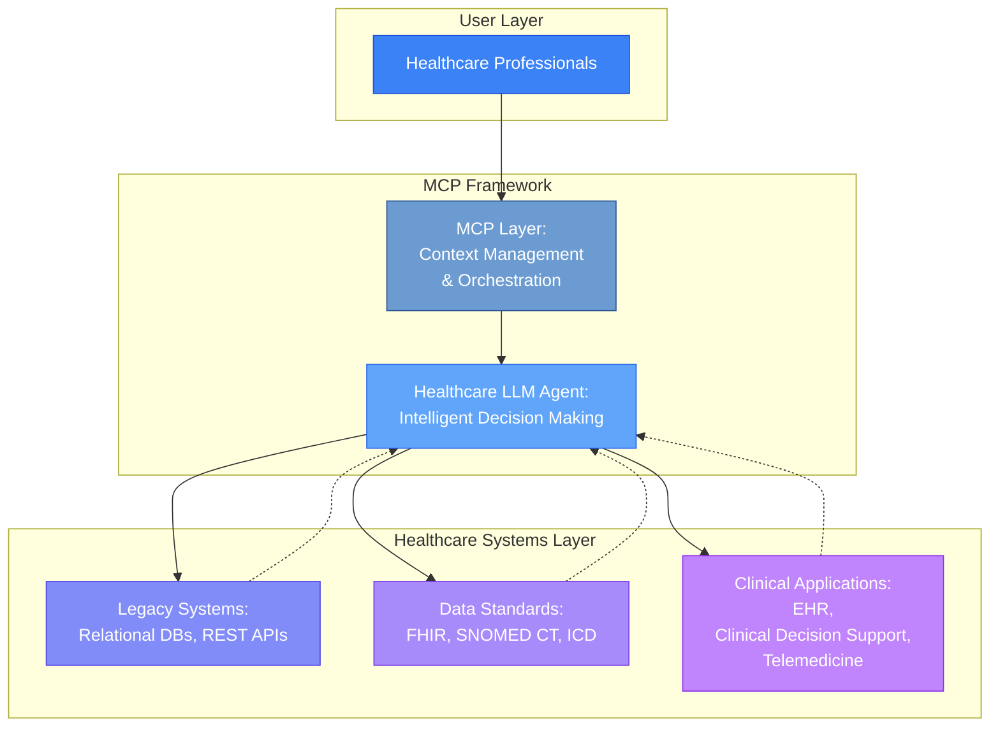
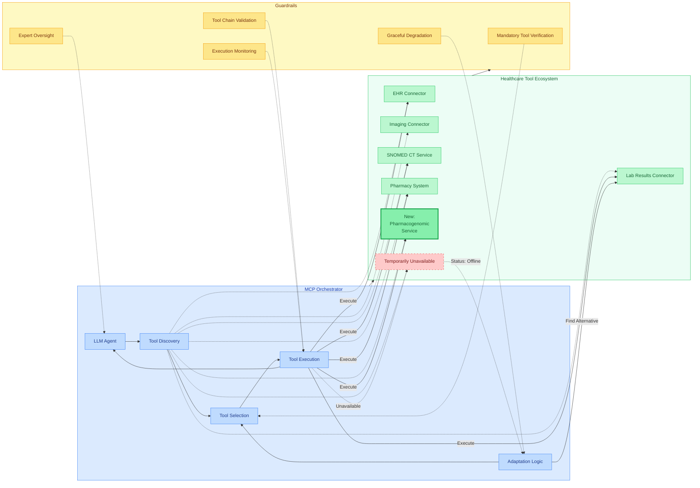
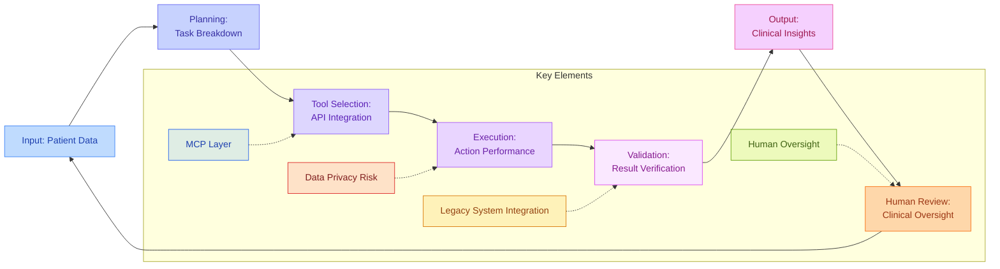
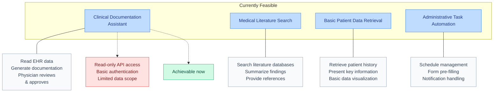
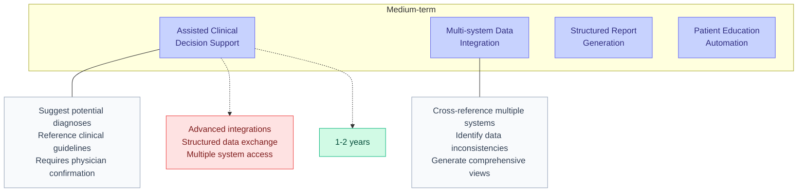
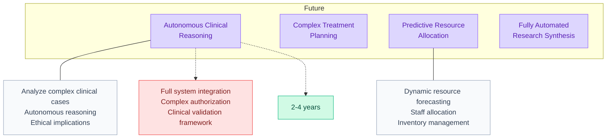
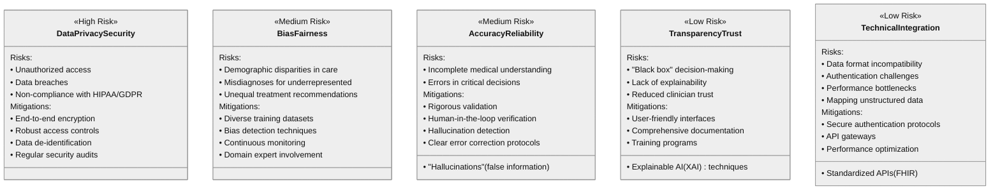

# Opportunities and Risks of LLM-Based Agentic Workflows in Healthcare Information Systems

> **Note 1:** This document explores both currently feasible and potential future applications of MCP (or agent-tooling protocols in general) in healthcare. Some advanced use cases describe theoretical possibilities rather than currently realistic solutions. The examples aim to illustrate the direction of development.


> **Note 2:**  This document and its diagrams are a quick draft resulting from collaboration between a human author and AI assistants (Gemini and Claude). List of original sources has been omitted from this draft.


## Executive Summary

The integration of large language model (LLM)-based agentic workflows holds promise for revolutionizing healthcare information systems. These advanced systems offer the potential to enhance clinical decision-making, automate a wide range of administrative and operational tasks, improve patient experiences, and accelerate medical research. However, this potentially transformative technology also presents considerable risks, particularly concerning the privacy and security of sensitive patient data, the potential for bias and inaccuracies in AI outputs, and the complex ethical and regulatory considerations that must be carefully navigated.

The Model Context Protocol (MCP) emerges as a potentially crucial enabling layer for these workflows, facilitating dynamic contextual adaptation and seamless interaction with existing IT infrastructure. This document explores both the opportunities and the inherent risks associated with adopting LLM-based agentic workflows within legacy healthcare systems, emphasizing the need for a balanced and strategic approach to implementation that prioritizes risk mitigation and ethical considerations to ensure a safe and effective integration.

## 1. Understanding the Model Context Protocol (MCP) Architecture

> **Note:**  It's important to note that while this document explores MCP within healthcare contexts, the Model Context Protocol is fundamentally domain-agnostic. Developed as a universal standard for AI system integration, MCP's architecture and capabilities apply equally across industries ranging from finance and legal to manufacturing and customer service. The healthcare applications described here represent just one domain where MCP's features—dynamic tool discovery, contextual adaptation, and standardized integration could provide significant value. The same architectural principles enable similar benefits in any sector requiring sophisticated AI orchestration and integration with existing systems.



The Model Context Protocol (MCP) represents a significant advancement in the way AI systems interact with healthcare environments. At its core, MCP is an open standard developed (by Anthropic, published on Nov 26th, 2024) to establish secure and standardized connections between AI assistants and the diverse systems where data resides, including content repositories, business tools, and internal databases.

### Dynamic Tool Discovery: A Key MCP Advantage

One of MCP's most powerful features is its ability to incorporate new tools without requiring modifications to the orchestrator itself. This "plug-and-play" architecture allows LLM agents to:

1. Dynamically discover available tools in the ecosystem
2. Select appropriate tools based on the current context and task requirements
3. Adapt to changes in the available toolset without reconfiguration

#### Example: Dynamic Tool Ecosystem in Clinical Decision Support

```
Scenario: A hospital adds a new pharmacogenomic analysis service to its IT ecosystem

Without MCP: The clinical decision support system would require manual updates, 
reconfiguration, and possibly redeployment to utilize the new service.

With MCP:
1. The new pharmacogenomic service is registered as an MCP server/connector
2. It publishes its capabilities and API via MCP's discovery mechanism
3. The LLM agent automatically discovers the new service during its next interaction
4. When encountering a medication decision that could benefit from pharmacogenomic insights:
   - The agent recognizes the relevance of the new tool
   - It invokes the pharmacogenomic service alongside existing tools
   - It incorporates the additional insights into its recommendations
5. No changes to the agent itself were required to utilize this new capability
```

#### Example: Adaptation to Tool Unavailability

```
Scenario: A clinical laboratory system temporarily goes offline during maintenance

Without MCP: Workflow interruption, manual workarounds needed, possible delays in care

With MCP:
1. Agent attempts to access laboratory data through the primary laboratory system
2. Upon detecting the system is unavailable, the agent:
   - Identifies alternative data sources (e.g., backup systems, cached data, summary reports)
   - Modifies its approach to use available tools and data
   - Transparently notes the limitations of the alternative approach in its output
   - Continues supporting the clinical workflow with best available information
3. When the primary system returns online, the agent automatically resumes using it
   without requiring intervention
```

This flexibility creates resilience in healthcare workflows, allowing continued operation even when specific tools or systems become unavailable.

### Risks of Dynamic Tool Orchestration

The flexibility of MCP-based agentic workflows introduces specific risks that must be addressed:

1. **Tool Selection Errors**: The agent might:
   - Fail to use an appropriate tool due to misunderstanding context
   - Select a less optimal tool when better ones are available
   - Miss critical tools required for comprehensive analysis

2. **Orchestration Sequence Issues**: 
   - Inefficient sequence of tool execution
   - Failure to properly chain tool outputs as inputs to subsequent tools
   - Inability to properly manage parallel vs. sequential tool execution

3. **Result Interpretation Challenges**:
   - Misinterpreting tool outputs or API responses
   - Failing to recognize when a tool produces incorrect results
   - Incorrectly combining information from multiple tools

4. **Transparency Limitations**:
   - Difficulty explaining which tools were used and why
   - Limited visibility into decision factors for tool selection
   - Challenges in auditing the complete tool chain

### Guardrails for Safe Tool Orchestration

To mitigate the risks associated with dynamic tool orchestration, several guardrails can be implemented:

1. **Mandatory Tool Verification**:
   - Critical healthcare functions maintain a list of required tools that must be used
   - Verification steps ensure all necessary tools were considered
   - Alerts when essential tools are skipped or unavailable

2. **Tool Chain Validation**:
   - Pre-defined patterns for common clinical workflows
   - Validation of tool execution sequences against best practices
   - Detection of unusual or potentially problematic tool combinations

3. **Expert Oversight Mechanisms**:
   - Clear highlighting of which tools were used in generating outputs
   - Confidence scores for tool selection decisions
   - Human review requirements for novel tool chains

4. **Execution Monitoring**:
   - Logging of all tool selections, executions, and outputs
   - Runtime monitoring for unexpected tool behavior
   - Circuit breakers for tools that consistently produce errors

5. **Graceful Degradation Protocols**:
   - Clearly defined fallback procedures when optimal tools are unavailable
   - Explicit communication of limitations when using alternative approaches
   - Appropriate escalation to human operators when tool limitations exceed acceptable thresholds

## 2. MCP Dynamic Tool Discovery and Orchestration

A fundamental advantage of MCP is its ability to facilitate dynamic tool discovery and orchestration, allowing healthcare LLM agents to adapt to evolving capabilities without system reconfiguration:



## 3. LLM-Based Agentic Workflow Process in Healthcare



The LLM-based agentic workflow in healthcare follows a structured process that enables intelligent and autonomous operation within clinical environments:

1. **Input**: The system receives patient data from various sources, including EHRs, laboratory results, and imaging studies
2. **Planning**: The agent breaks down complex clinical tasks into manageable steps based on the context and user needs
3. **Tool Selection**: The appropriate tools and APIs are selected for accessing necessary resources, such as medical databases or SNOMED CT terminologies
4. **Execution**: The agent performs actions such as data analysis, pattern recognition, or clinical decision support
5. **Validation**: Results are verified against medical knowledge and validated for accuracy and reliability
6. **Output**: Clinical insights, recommendations, or automated documentation are generated for healthcare professionals
7. **Human Review**: Clinical oversight ensures that all AI-generated content is reviewed by qualified healthcare professionals

## 4. Possible MCP Implementation Examples in Healthcare

> **Note**: The examples below are synthetic and likely not worth deep contemplation at the moment.

To provide a more concrete understanding of what's feasible with MCP in healthcare settings at different time horizons, the following diagrams illustrate implementation examples ranging from currently achievable to more aspirational future goals.

### 4.1 Currently Feasible Implementations



### 4.2 Medium-term Possibilities



### 4.3 Future Aspirational Goals



This diagram illustrates the progression of MCP implementations from basic assistance to more sophisticated autonomous capabilities, with corresponding technical requirements and realistic timeframes.

## 5. Opportunities of LLM-Based Agentic Workflows in Healthcare

> **Tool Orchestration Note**: Each opportunity area below requires the LLM orchestrator to have access to appropriate specialized tools and knowledge sources. The orchestrator might typically work with natural or formal language descriptions of workflows, decision criteria, and contextual rules that guide its tool selection and execution sequence. The value delivered is directly proportional to the quality and completeness of the available tool ecosystem.

> **Note**: The examples below are synthetic and likely not worth deep contemplation at the moment.

### Enhancing Clinical Decision Support   
- Real-time monitoring of patient data to identify early signs of conditions like sepsis *(requires vital sign monitoring tools, lab result connectors, and clinical alert protocols)*
- Analysis of comprehensive patient information to suggest appropriate treatment plans and diagnoses *(leverages EHR integration, knowledge base tools, and evidence-based guideline repositories)*
- Context-aware reasoning leveraging structured medical knowledge (SNOMED CT) *(depends on terminology service tools and semantic reasoning capabilities)*
- Proactive recommendations for patient interventions based on evolving clinical contexts *(utilizes temporal data analysis tools and recommendation engines)*
- Improved diagnostic accuracy through automated analysis of complex medical data *(employs imaging analysis tools, lab result interpreters, and statistical pattern recognition)*

### Streamlining Administrative and Operational Tasks
*(Guided by administrative workflow descriptions and operational protocols)*

- Automation of routine medical tasks: data entry, information search and aggregation *(uses document processing tools, structured data entry interfaces, and information retrieval systems)*
- Generation of comprehensive patient summaries, discharge documents, and reports *(employs document generation tools with templates and clinical guideline integration)*
- Automation of appointment scheduling, claims processing, and prior authorizations *(leverages scheduling systems, claims processing tools, and insurance database connectors)*
- Optimization of hospital resource allocation: staffing schedules, bed availability, supplies *(utilizes resource management systems, scheduling algorithms, and inventory tracking tools)*
- Reduction in administrative burden, allowing staff to focus on patient care *(combines workflow automation tools with prioritization mechanisms)*

### Improving Patient Engagement and Experience
*(Orchestrated through patient communication protocols and personalization guidelines)*

- AI assistants for personalized patient support and education *(employs conversational interfaces, patient record access tools, and educational content repositories)*
- Continuous 24/7 support through intelligent chatbots *(leverages messaging platforms, symptom assessment tools, and escalation protocols)*
- Medication reminders and adherence monitoring *(uses notification systems, medication database tools, and patient response tracking)*
- Tailored treatment plans based on individual patient characteristics *(combines patient profile analysis tools with treatment guidelines and personalization engines)*
- Improved accessibility to healthcare information outside clinic hours *(utilizes knowledge base tools with simplified medical terminology and multi-language support)*

### Advancing Research and Drug Discovery
*(Following research methodology frameworks and scientific protocols)*

- Rapid analysis of vast medical literature and scientific papers *(leverages literature database connectors, citation analysis tools, and research summary generators)*
- Identification of potential drug candidates and prediction of interactions *(employs molecular modeling tools, chemical database access, and interaction prediction algorithms)*
- Acceleration of drug development pipelines and clinical trial optimization *(uses trial design tools, patient cohort analyzers, and regulatory compliance checkers)*
- Analysis of molecular data for pharmaceutical research *(combines genomic analysis tools, protein structure databases, and pathway mapping systems)*
- Extraction of valuable insights from complex scientific datasets *(utilizes statistical analysis tools, visualization generators, and pattern recognition systems)*

### Optimizing Resource Allocation and Workflow Management
*(Guided by operational efficiency frameworks and resource optimization rules)*

- Dynamic adjustment to changing patient needs and resource availability *(employs real-time monitoring tools, demand forecasting systems, and resource allocation algorithms)*
- Real-time decision-making based on diverse data inputs *(leverages data integration tools, rules engines, and anomaly detection systems)*
- Enhanced care coordination among different specialists and departments *(uses workflow coordination tools, communication platforms, and care pathway trackers)*
- Holistic view of patient needs through synthesis of fragmented data sources *(combines data aggregation tools, patient timeline generators, and comprehensive visualization systems)*
- Prediction of high-risk patients requiring immediate intervention *(employs risk stratification tools, predictive modeling systems, and alert generation mechanisms)*


## 6. Risk and Mitigation Matrix for Healthcare LLM Implementation



## 7. Comparison of MCP with Existing Healthcare Technologies

These comparison technologies share an important characteristic with MCP: they each
introduce elements of dynamism to systems. HATEOAS, while domain-agnostic and part
of REST architectural principles, might be familiar to healthcare domain implementers
through FHIR standard, enabling runtime discovery of available actions through hypermedia
links. SNOMED CT facilitates dynamic clinical reasoning through traversable relationships
between medical concepts. OpenEHR query languages permit flexible data access patterns
that adapt to evolving clinical data models. MCP builds upon this tradition of dynamic
system behavior, unifying and extending these capabilities through LLM-powered orchestration
that can discover, reason about, and adaptively coordinate tools in response to changing
contexts. Where these existing technologies each address specific aspects of dynamic
system behavior, MCP provides a comprehensive framework for intelligent, context-aware
orchestration across the entire healthcare technology ecosystem

| Feature | HATEOAS | SNOMED CT | openEHR Query Languages (AQL, GDL) | MCP |
|---------|---------|-----------|-----------------------------------|-----|
| **Primary Purpose** | API navigation and action discovery | Standardized medical terminology | Structured data querying and decision logic | Dynamic workflow automation and decision-making based on contextual models |
| **Context Awareness** | Limited to API state transitions | Supports context-aware reasoning based on codified medical knowledge | Allows structured, computable queries | Enables higher-level contextual reasoning and agentic decision-making within a system |
| **Dynamic Adaptation** | Enables discoverability and action-driven state transitions dynamically | Terminology standard; context is inherent in the codes and relations | Requires pre-defined queries and logic | Facilitates dynamic workflow automation and decision-making based on evolving context |
| **Agentic Capabilities** | No inherent agentic capabilities | No inherent agentic capabilities | Limited to pre-defined logic | Enables proactive, context-aware agents that can anticipate needs and recommend actions |
| **Focus** | API interaction | Medical terminology and ontology | Data retrieval and decision support | Dynamic workflow orchestration, contextual reasoning, and integration with external tools and data |

## 8. Risk-Benefit Analysis of MCP Flexibility

> This chapter has not been reviewed.

The flexible nature of MCP's dynamic tool orchestration presents both significant benefits and notable risks that must be carefully balanced:

| Aspect | Benefits | Risks | Mitigation Approaches |
|--------|----------|-------|----------------------|
| **Tool Discovery** | • New capabilities available without reconfiguration<br>• Future-proofing of systems<br>• Reduced integration maintenance | • Discovery of inappropriate tools<br>• Overwhelming tool options causing selection errors<br>• Incomplete discovery of critical tools | • Whitelisting approved tools<br>• Tool categorization and metadata<br>• Mandatory capability verification |
| **Tool Selection** | • Context-aware tool choices<br>• Optimization for specific scenarios<br>• Adaptive to user needs | • Selection of less optimal tools<br>• Missing critical tools for comprehensive analysis<br>• Inappropriate tool combinations | • Required tool lists for critical functions<br>• Selection validation against patterns<br>• Confidence thresholds for selection decisions |
| **Workflow Orchestration** | • Dynamic adaptation to tool availability<br>• Customized workflows per context<br>• Efficient sequencing possibilities | • Inefficient execution sequences<br>• Missing dependencies between tools<br>• Unnecessary tool execution | • Workflow templates as guidance<br>• Dependency mapping between tools<br>• Performance monitoring and optimization |
| **Failure Handling** | • Graceful degradation when tools fail<br>• Automatic fallback to alternatives<br>• Resilience to system outages | • Cascade failures across tools<br>• Incorrect alternatives selection<br>• Degraded performance without notification | • Circuit breakers for failing tools<br>• Clear documentation of limitations<br>• Explicit notification of degraded service |
| **Transparency** | • Potential for detailed execution traces<br>• Insight into decision-making<br>• Ability to audit tool usage | • "Black box" orchestration decisions<br>• Difficulty explaining tool choices<br>• Complex audit trails | • Comprehensive logging of all decisions<br>• Explainable tool selection logic<br>• Visualization of tool chains |
| **Governance** | • Centralized policy enforcement<br>• Consistent application of rules<br>• Adapts to regulatory changes | • Unclear responsibility for errors<br>• Difficulty enforcing policies across tools<br>• Regulatory compliance challenges | • Clear accountability frameworks<br>• Policy enforcement at orchestrator level<br>• Regular compliance audits |

Understanding this balance is crucial for healthcare organizations implementing MCP-based systems, as it allows for maximizing the flexibility benefits while establishing appropriate safeguards for the associated risks.

## 9. Current Limitations and Implementation Realities

While the potential of MCP and LLM-based agentic workflows in healthcare is compelling, several practical limitations should be acknowledged:

### Current MCP Implementation Limitations

- **Integration Complexity**: Existing healthcare systems often have limited API capabilities, making full MCP integration challenging without significant custom development
- **Authentication Standardization**: Healthcare systems use varying authentication mechanisms that may not easily adapt to MCP's authentication model
- **Workflow Autonomy**: Current implementations typically require significant human oversight and intervention rather than achieving full autonomy
- **Learning Curve**: Organizations need time and resources to develop expertise in effectively implementing and managing MCP-based systems

### Real-World Implementation Considerations

- **Start with Focused Use Cases**: Begin with narrow, well-defined applications like documentation assistance or basic information retrieval before progressing to more complex workflows
- **Phased Approach**: Implement in stages, starting with read-only capabilities before allowing systems to write back to healthcare databases
- **Hybrid Solutions**: Combine MCP with existing integration approaches rather than wholesale replacement
- **Regulatory Validation**: Plan for extensive validation processes, especially for clinical decision support functionalities

## 10. Conclusion: Towards an Intelligent and Responsible Healthcare Future

LLM-based agentic workflows hold immense potential to revolutionize healthcare information systems, offering opportunities to enhance clinical decision-making, streamline operations, improve patient engagement, and accelerate medical research. This technology promises a future where intelligent agents can augment the capabilities of healthcare professionals, leading to greater efficiency, more personalized care, and ultimately, better patient outcomes.

However, the path towards this intelligent future requires careful navigation of significant challenges related to data privacy, bias, accuracy, transparency, and technical integration. A thoughtful and strategic approach to implementation, guided by strong ethical principles and robust risk management strategies, will be essential for healthcare organizations to responsibly harness the transformative power of these advanced AI systems.

By prioritizing patient safety, data security, and ethical considerations throughout the development and deployment process, the healthcare industry can work towards an AI-enabled future that truly benefits patients, providers, and the healthcare system as a whole.
